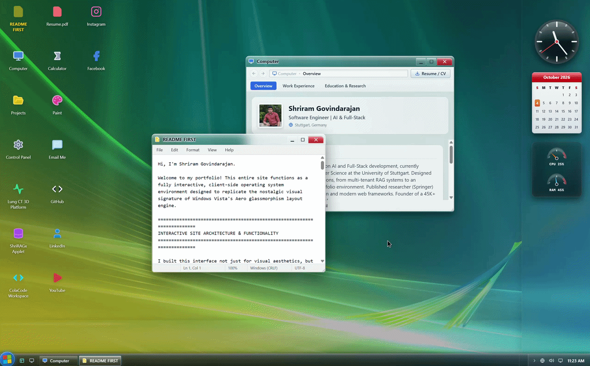

# Windows Vista Aero Portfolio Workstation

  
  
  

    <strong>A high-fidelity, client-side operating system environment replicating the Windows Vista Aero interface.</strong> 
    Built with React, Vite, and Tailwind CSS to house live interactive deployments, real-time client diagnostics, procedural Web Audio soundscapes, 3D window compositing, and an authentic Desktop Window Manager (DWM) visual hierarchy.
  

  

    <a href="https://shriram.is-a.dev"><strong>Explore Live Workstation</strong></a> •
    <a href="#core-architectural-subsystems"><strong>Architecture</strong></a> •
    <a href="#control-panel-diagnostics-suite"><strong>Diagnostic Suite</strong></a> •
    <a href="#keyboard-shortcuts--controls"><strong>Controls</strong></a> •
    <a href="#production-deployments"><strong>Projects</strong></a>
  

---

## Overview

Rather than serving conventional flat web pages or portfolio templates, this project implements a client-side operating system workstation inspired by Windows Vista's Aero glassmorphism layout engine. It serves as an integrated workspace featuring dynamic glass diffusion, genuine hardware GPU/CPU probing, an 8-axis window management matrix, sandboxed application applets, a procedural Web Audio sound synthesizer, and an authentic Microsoft Agent (Clippy) telemetry assistant.

---

## Core Architectural Subsystems

### 1. Desktop Window Manager (DWM) & Compositing Pipeline
- **Live Glass Diffusion Pipeline:** Translucency across window bezels, taskbars, flyouts, and sidebars is governed dynamically via CSS custom property injection (`--aero-blur: 16px`), calibratable in real time from the Control Panel.
- **Ancestor Stacking Isolation:** Wallpaper saturation and contrast adjustments are isolated onto an independent canvas layer (`#vista-wallpaper-surface`). This circumvents the Chromium rendering limitation where ancestor CSS filters flatten child `backdrop-filter` rendering buffers.
- **Specular Glare Sweeps & Ambient Halos:** Title bars feature multi-stop specular light sweeps and ambient white text glow halos (`textShadow: 0 0 10px rgba(255,255,255,0.95)`), ensuring crisp readability of dark typography across translucent glass.
- **Authentic Window Controls & 8-Axis Sizing:**
  - Low-baseline minimize tab (`―`) with specular reflections.
  - Pixel-aligned square maximize and overlapping restore-down toggles (`☐` / `❐`).
  - Ruby-red Aero close buttons with custom corner radii (`rounded-tr-[8px]`) and active glow rings.
  - Multi-directional perimeter resizing (North, South, East, West) and 4-corner handles with authentic Vista grip dots.

### 2. Aero Peek Live Taskbar Previews
- **Debounced Hover Intent Engine:** Hovering over running window tablets on the Aero glass taskbar activates an Aero Peek thumbnail popup with a 250ms debounced intent delay.
- **Proportional CSS Matrix Scaling:** Previews render scaled, interactive miniature views of the active window viewport using CSS transform matrices (`transform: scale(...)`), complete with program identification and a direct close action.
- **Stacking Tier Architecture:** Taskbar elements reside on an independent `z-[80]` tier, allowing the 3D Start Orb to float over adjacent panels.

### 3. Hardware-Accelerated Windows Flip 3D (`V` + `F`)
- **Forward-Facing 3D Depth Stack:** Replicates Windows Vista's signature Flip 3D window compositor. Arranges open applets along a perspective depth stage (`perspective: 1400px`) using 3D spatial coordinate offsets.
- **Navigation Modalities:** Pressing `'V'` + `'F'` simultaneously or clicking the Quick Launch 3D toolbar icon toggles the perspective stage. Supports mouse-wheel scrolling, Arrow Left/Right cycling, Tab stepping, and direct click-to-focus selection.
- **Dynamic Specular Reflection Floor:** Renders real-time inverted floor reflections beneath each active card using CSS `scaleY(-1)` and linear alpha masks.

### 4. Zero-Asset Tactile Synthesizer (Web Audio API)
Generates native Windows Vista soundscapes in real time via programmatic oscillator nodes without external audio files. Includes the harmonic boot chime (Eb major 9th swell), directional pitch-ramping glides for window minimization/restoration, Ruby Wedge close triggers, and Flip 3D crystalline pings. Features a functional system tray volume mixer with master gain and muting controls.
- **Aero Volume Flyout:** System tray speaker icon controlling procedural gain and mute toggles via a beveled vertical track.

### 5. Context-Aware Retro Assistant (Clippy)
- **Screen & Context Telemetry:** Monitors active window IDs, Start Menu states, Flip 3D toggles, and shutdown prompts. Automatically delivers relevant guidance when users switch between applications (e.g., explaining WebGL diagnostics inside Control Panel or sandbox controls in IE8).
- **Proactive Idle & Click Trivia Engine:** If the user is inactive for 15+ seconds, the assistant dispenses non-repeating trivia detailing Web Audio math, DWM blur isolation, WebGL GPU probes, and system architecture.
- **Workstation Lifecycle Integration:** Completely unmounts and purges all injected DOM elements (`.clippy`, `.clippy-balloon`) during log-off and power-off sequences. Restarts afresh with a greeting on reboot.
- **Mobile & Desktop Dragging:** Integrated touch and pointer capture engine clamping within screen bounds and resting cleanly above the 40px taskbar.

### 6. Relational Desktop Grid, Marquee & Context Menu
- **Column-Flow Desktop Layout:** Implements CSS Grid column flow (`grid-flow-col`), filling icons top-to-bottom before wrapping horizontally.
- **Cyan Rubber-Band Selection:** Dragging across the desktop surface triggers a 2D bounding marquee calculation (`Math.hypot`), selecting all intersecting icons.
- **Aero Desktop Context Menu:** Right-clicking the empty desktop opens a glass context menu to toggle between Medium and Classic icon sizes, trigger an F5 desktop flicker refresh, open Flip 3D, or access personalization settings.

### 7. Sandboxed IE8 Applets & Adaptive Scaling
- **Simulated Internet Explorer 8 Shell:** Production web deployments run inside nostalgic browser wrappers featuring:
  - Hardware-emulated green "Protected Mode: On" security badges.
  - Read-only address bar with refresh button and external popout launcher.
  - Tab navigation header and status bar tracking intranet zones.
- **Adaptive Matrix Scaling:** A `ResizeObserver` coordinates with CSS zoom and scale transforms. Desktop resolutions display full 1280px layouts scaled to window bounds; resizing below 640px automatically shifts to mobile viewport rendering.

### 8. Choreographed Multi-Stage Shutdown & Power Cycle
- **Draggable Confirmation Dialog:** Frosted glass modal with pointer-captured drag physics.
- **Multi-Stage Lifecycle:**
  1. Immediate modal dismissal.
  2. Synchronized scaling and opacity fade across open windows, desktop icons, and taskbars (`450ms`).
  3. Fullscreen blackout transition (`400ms`).
  4. Fade-in of the translucent Vista log-off screen with avatar and loading spinner (`5s`).
  5. Standby power-off state with an ambient cyan LED halo button allowing instant system reboot.

### 9. Native Utilities & Desktop Sidebar Gadgets
- **Paint Utility:** HTML5 Canvas drawing tool featuring multi-color swatches, brush stroke scaling, touch handling, and canvas clearing.
- **Calculator Utility:** Floating-point arithmetic calculator supporting mouse and keyboard operations.
- **Vista Sidebar:** Glass panel housing a ticking analog clock, perpetual calendar widget, and dual SVG dial speedometers tracking simulated CPU and RAM activity.

### 10. Touch Input & Pointer Event Architecture

Every interactive surface — window drag, 8-axis resize, desktop marquee, shutdown dialog, volume slider, Paint canvas, and the Clippy assistant — runs through a unified Pointer Events pipeline that behaves identically under mouse, stylus, and finger input.

- **Unified Pointer Events with Capture on `currentTarget`:** All drag and resize logic binds `onPointerDown` / `onPointerMove` / `onPointerUp` and calls `setPointerCapture()` on `e.currentTarget`, not `e.target`. React re-renders replace child DOM nodes mid-drag; capturing on a node that is about to be unmounted silently drops the gesture stream.
- **Pointer-ID Guards:** Each drag session stores its initiating `pointerId` and discards any subsequent move events whose ID does not match. This eliminates multi-touch cross-talk where a second finger would otherwise steal the active drag.
- **Gesture Ownership via `touch-action: none`:** Every draggable surface declares `touch-action: none`, which instructs the browser that the element owns the gesture. Without this, Chrome and Safari interpret the movement as a scroll or pinch-zoom intent and fire `pointercancel` mid-drag, terminating the interaction.
- **Coarse-Pointer Hit-Zone Expansion:** A `@media (pointer: coarse)` media query detects finger-driven devices and expands the invisible resize hit zones — edges from 2px → 16px, corners from 4px → 26px — while the visual Aero bezel remains 1px. Mouse-driven desktops keep the original tight hit zones.
- **iOS Callout Suppression:** Global `-webkit-touch-callout: none` and `-webkit-tap-highlight-color: transparent` prevent the iOS long-press callout and Android tap-highlight flash from interrupting window drags and icon selections.
- **Overscroll Containment:** `overscroll-behavior: none` on the root shell disables pull-to-refresh and rubber-band scroll during desktop marquee operations.
- **Clippy Touch Drag Patch (`patch-package`):** The upstream `clippyjs` package ships mouse-only drag code — its `Agent` class binds `mousedown` / `mousemove` / `mouseup` with no touch counterpart, and its TypeScript definitions accept only `MouseEvent`. Rather than forking the dependency, a six-location source patch was authored inside `node_modules/clippyjs/dist/index.js`:
  1. Register `touchstart` on the sprite in `_setupEvents` with `{ passive: false }`.
  2. Force `touchAction = "none"` inline on the sprite element.
  3. Register `touchmove` / `touchend` / `touchcancel` on `window` inside `_startDrag`.
  4. Normalize coordinate reads in `_calculateClickOffset` to prefer `e.touches[0]`.
  5. Normalize coordinate reads in `_dragMove` with the same touch-first fallback.
  6. Remove the added listeners in both `_finishDrag` and `dispose`.

  The patch is frozen into `patches/clippyjs+*.patch` and reapplied automatically through a `postinstall` npm hook, surviving both local reinstalls and CI pipelines without additional configuration.

---

## Control Panel Diagnostics Suite

The Control Panel provides an administrative systems suite with instant switching between **Classic Tiles** and **Details List** views:

| Diagnostic Applet | Subsystem Scope | Operational Functionality |
| :--- | :--- | :--- |
| **DirectX & 3D WebGL Diagnostics** | Hardware Probing (`dxdiag`) | Live WebGL canvas query utilizing `WEBGL_debug_renderer_info` to identify unmasked physical GPU model, vendor, maximum texture bounds, and GL shading language version. |
| **Performance & Resource Monitor** | System Diagnostics (`perfmon`) | Evaluates client logical CPU thread concurrency (`navigator.hardwareConcurrency`), device pixel ratio, screen dimensions, and frame budget. |
| **Display & Aero DWM Calibration** | Desktop Environment (`desk.cpl`) | Interactive DOM sliders directly adjusting root `--aero-blur` diffusion (0px to 32px) and wallpaper contrast (70% to 140%) in real time. Now with Live wallpaper selection. |
| **Inbound Recruiter Console** | Communication Dispatcher | Pre-configured message generator formulating email outreach drafts for full-time engineering or agentic AI roles. |

*All calibration settings and view preferences persist across window sessions through a unified `VISTA_SESSION_SETTINGS` store.*

---

## Production Deployments

- **Lung Analysis 3D: Thoracic CT Discovery Platform**  
  *Stack:* Three.js, WebGL, vis.js, FastAPI, Docker, PostgreSQL  
  Interactive 3D thoracic CT platform featuring point-cloud reconstruction, spatial raycasting, and volume slicing.  
  [Live Demo](https://lung-analysis-demo.vercel.app/)

- **ShriRAGx: Agentic Document Intelligence Platform**  
  *Stack:* Python, LangGraph, ChromaDB, FastAPI, Docker, Azure Cloud  
  Multi-tenant RAG architecture with agentic retrieval workflows, semantic search, and document classification.  
  [Live Deployment](https://shriram-agentic-rag.austriaeast.cloudapp.azure.com/)

- **ColaCode: Real-Time Collaborative Workspace**  
  *Stack:* React, Node.js, WebSockets, Yjs CRDTs, Redis, PostgreSQL  
  Low-latency collaborative coding editor with state convergence and room synchronization.  
  [Live Workspace](https://colacode.netlify.app/)

- **FSx: High-Concurrency Flash Sale Backend**  
  *Stack:* Go, PostgreSQL, Redis, Docker, k6  
  High-throughput e-commerce inventory transaction engine stress-tested for concurrency spikes.  
  [Live API](https://fsx-flash-sale-backend-go.up.railway.app/)

---

## Keyboard Shortcuts & Controls

| Action | Shortcut / Trigger | Description |
| :--- | :--- | :--- |
| **Windows Flip 3D** | `V` + `F` | Opens the 3D window perspective carousel. |
| **Cycle Flip 3D** | `Mouse Wheel` / `Arrow Keys` | Steps forward or backward through running applets. |
| **Confirm Flip 3D** | `Enter` / `Click` | Focuses and maximizes selected window. |
| **Exit Flip 3D** | `Escape` | Dismisses 3D carousel and returns to desktop. |
| **Desktop Context Menu** | `Right-Click` on desktop | Displays Aero context menu (View, Refresh, Flip 3D). |
| **Marquee Selection** | `Click + Drag` on desktop | Draws rubber-band box to select multiple icons. |
| **8-Axis Window Resizing** | `Drag Borders / Corners` | Resizes windows from all perimeter edges and corners. |
| **Aero Peek Previews** | `Hover Taskbar Button` | Displays live thumbnail preview after 250ms debounce. |
| **Workstation Wake** | `Click Power Button` | Boots workstation from standby power-off mode. | 

---

## Touch Gestures & Mobile Controls

| Action | Gesture | Description |
| :--- | :--- | :--- |
| **Drag Window** | Touch + Drag Title Bar | Repositions the window with 1:1 finger tracking via pointer capture. |
| **Resize Window** | Touch + Drag Edge / Corner | 8-axis resize with expanded touch hit zones (16px edges, 26px corners). |
| **Drag Clippy** | Touch + Drag Sprite | Moves the assistant via the `patch-package`-applied touch listener. |
| **Draw in Paint** | Touch + Swipe Canvas | Multi-touch-aware canvas drawing with `touch-action: none`. |
| **Desktop Marquee** | Touch + Drag Empty Desktop | Rubber-band selects intersecting desktop icons. |
| **Adjust Volume** | Touch Vertical Slider | Drag the silver Vista thumb on the tray flyout. |
| **Open Context Menu** | Long-Press Desktop | Triggers the Aero glass right-click menu (native callout suppressed). |
| **Confirm Flip 3D** | Tap Front Card | Focuses the highlighted window and dismisses the 3D stage. |
| **Dismiss Menus / Flyouts** | Tap Outside | Standard Aero outside-tap dismissal across all panels. |

---

## Tech Stack & Architecture

- **Frontend Core:** React 18, JSX, Hooks (`useRef`, `useState`, `useEffect`, `useMemo`).
- **Styling Engine:** Tailwind CSS with custom Aero glass filters, specular gloss gradients, and Segoe UI typography.
- **Audio Synthesis:** Web Audio API (`AudioContext`, `OscillatorNode`, `GainNode`, `BiquadFilterNode`).
- **Icons & Visuals:** Lucide React, Three.js, WebGL2 hardware bindings, HTML5 Canvas, SVG vectors.
- **Office Assistant:** `clippyjs` agent integration with proactive idle and telemetry watchers.
- **Dependency Patching:** `patch-package` with a `postinstall` hook persisting the six-location touch-drag source patch applied to `clippyjs`.
- **Build & Bundler:** Vite 5+ (ES modules, HMR, optimized production tree-shaking).
- **Static Hosting:** GitHub Pages.

---

## Acknowledgements & Copyright

- Windows Vista and the "img24" wallpaper are registered trademarks of Microsoft Corporation. Used here strictly for non-commercial educational and portfolio demonstration purposes.
- Microsoft Office Assistant "Clippy" is a registered trademark of Microsoft Corporation. Agent animations provided via open-source `clippyjs` for demonstration only.
- Icons by [Lucide](https://lucide.dev) under the ISC license.
- Built by **Shriram Govindarajan** (M.Sc. Computer Science, University of Stuttgart).